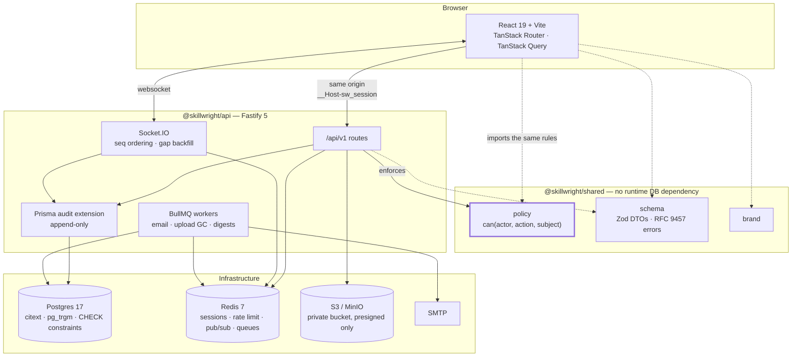

# Skillwright

**A permissions-first training platform. It happens to teach welding.**

[](https://github.com/kaleem-Durrani/skillwright/actions/workflows/ci.yml)
[](docs/permissions.md)
[](https://github.com/kaleem-Durrani/skillwright/actions/workflows/ci.yml)
[](LICENSE)

> **TODO — screenshots.** Hero shot (course catalogue, 375px and desktop side by side), the permission matrix rendered, and the enrollment approval flow. Not linked until the files exist; a broken image is worse than no image.

---

Most role-based applications check permissions wherever the developer remembered to add a guard. The rules live in middleware, in controllers, in `user.role === 'admin'` scattered through the UI — and nothing anywhere states what the rules actually _are_. That is not a strawman. It is a description of this repository's own previous incarnation, which shipped four authorization middlewares, five inline copies of the same logic, one middleware that ran before authentication so its body was unreachable, and zero tests asserting that a student could not read another course's private resources.

Skillwright inverts that. One declarative policy defines every `(actor, action, subject)` rule once. The HTTP layer, the realtime layer and the React UI all derive from that single source — so a button that would return 403 never renders, and there is no second place for the rules to drift to.

The domain is a vocational training institute: departments, courses, enrollment with seat limits, teaching resources with threaded comments, and realtime messaging between staff and students. **The domain is the stage, not the pitch.**

---

## Three claims

Each of these is falsifiable, and each links to the thing that would falsify it. If a link is red, the claim is wrong.

### 1. Every authorization rule is stated once, and the documentation cannot lie about it

`can(actor, action, subject)` is a pure function with no I/O and no database import. The full role × action × subject-state matrix is asserted in CI — including the negative cases that matter: a teacher planting a resource in another teacher's course, a student reading a private resource for a course they are not enrolled in, a suspended account doing anything at all, and an `MFA_PENDING` session doing anything other than finishing its login.

`docs/permissions.md` is **generated from the policy**, never written by hand. A separate CI job regenerates it and fails the build if the checked-in file differs.

44 actions × 4 caller classes = **176 cells in the role matrix**, plus **220 more** covering account status and session provenance. All 396 are in [`docs/permissions.md`](docs/permissions.md), and every one of them was produced by the policy rather than by a person.

> **Proof:** [`packages/shared/test/policy-matrix.test.ts`](packages/shared/test/policy-matrix.test.ts) · [`packages/shared/src/policy/policy.ts`](packages/shared/src/policy/policy.ts) · [`scripts/generate-permissions-doc.ts`](scripts/generate-permissions-doc.ts) · [`docs/permissions.md`](docs/permissions.md) · the `permissions-doc` job in [`.github/workflows/ci.yml`](.github/workflows/ci.yml)
>
> **How to falsify it:** change one rule in `packages/shared/src/policy/` without regenerating the docs. CI goes red.

### 2. Renaming a database column breaks the build, on purpose

Prisma's schema is the single source of truth. Nothing between Postgres and the SPA is hand-typed. The claim that this is _actually_ true — rather than true until someone wrote an `any` — is tested on every push by a workflow that sabotages the schema and asserts the build fails.

It renames `Course.capacity` on a scratch branch, regenerates the client, runs `pnpm -r typecheck`, and **fails the job if the typecheck passes**. An inverted assertion: a green typecheck means the type chain has a hole in it.

> **Proof:** [`.github/workflows/contract-drift.yml`](.github/workflows/contract-drift.yml)
>
> **How to falsify it:** hand-write a `Course` interface in `apps/web/src` and watch this job start failing.

### 3. A 30-seat course cannot be oversold, even by 200 people at once

Capacity is enforced by a conditional atomic `UPDATE` plus a Postgres `CHECK` constraint, not by a read-then-write in application code. Two hundred concurrent approvals against a thirty-seat course produce exactly thirty approvals and one hundred and seventy `409 CAPACITY_EXCEEDED` responses. The database refuses to oversell even if the application logic is wrong, which is the only version of this guarantee worth having:

```sql
ALTER TABLE "Course" ADD CONSTRAINT course_capacity_sane
  CHECK ("approvedCount" >= 0 AND "approvedCount" <= "capacity");
```

> **Proof:** [`packages/db/prisma/migrations/0002_constraints/migration.sql`](packages/db/prisma/migrations/0002_constraints/migration.sql) · [ADR 0006](docs/adr/0006-atomic-increment-over-serializable.md) · **TODO** — the 200-way concurrency assertion lands as `apps/api/test/enrollments.test.ts` with the enrollments module; not linked until it exists.
>
> **How to falsify it:** replace the conditional `UPDATE` with `SELECT count → compare → INSERT`. The constraint turns the race into a failed transaction instead of an oversold course.

---

## Quickstart

```bash
pnpm install
docker compose up -d --wait && pnpm db:migrate && pnpm db:seed
pnpm dev
```

The API is on `http://localhost:3000`, the SPA on `http://localhost:5173`, MinIO's console on `:9001`, and every outbound email lands in Mailpit at `http://localhost:8025`. The seed is deterministic and creates one demo account per role.

There is no step four.

---

## Architecture



The dotted lines are the point. `packages/shared` has **no runtime dependency on Prisma or the database**, which is what lets the SPA import the exact function the API enforces with. The policy module is not a copy of the rules; it is the rules.

In production there is one origin: the API process serves the built SPA, so `/api/v1/*` is the API and everything else falls through to `index.html`. No CORS, no `SameSite=None`, no cross-origin credential surface — see [ADR 0004](docs/adr/0004-same-origin-sessions-and-csrf.md).

### Repository layout

```
apps/api        Fastify 5 · routes, services, realtime, jobs
apps/web        React 19 · TanStack Router · Tailwind v4
packages/shared policy · Zod DTOs · brand — imported by both
packages/db     Prisma schema, committed migrations, seed, audit extension
scripts/        brand check · mobile-first check · permissions-doc generator
docs/adr/       eight decisions, each under 300 words, each naming its tradeoff
```

---

## Mobile-first, and it is checked

Not "responsive." Mobile-first, strictly, and enforced by a script rather than by intention.

Base styles target the smallest viewport. Breakpoints only ever _add_, via `min-width`. `scripts/check-mobile-first.ts` runs in CI and fails the build on `max-width` media queries, Tailwind `max-*` variants, `100vw`, bare `vh` units, raw hex colours, stock Tailwind palette classes, and inline colour styles.

Touch targets are 44×44 CSS px. The shell is a bottom tab bar on mobile and a sidebar from `md` up — not a sidebar that collapses into a hamburger. Data tables are card lists by default and become tables from `md` up; the table is the enhancement. Playwright runs iPhone 13 and Pixel 7 projects alongside desktop Chromium, and the Lighthouse gate is mobile ≥ 90.

Details and the escape hatch: [ADR 0008](docs/adr/0008-mobile-first-as-a-constraint.md).

---

## Stack

| Layer          | Choice                                          | Why this one                                                                                                                                            |
| -------------- | ----------------------------------------------- | ------------------------------------------------------------------------------------------------------------------------------------------------------- |
| Language       | TypeScript 5.7, strict, ESM                     | `noUncheckedIndexedAccess` and `exactOptionalPropertyTypes` on. `any` requires a comment justifying it.                                                 |
| Runtime        | Node 22 LTS                                     | Native ESM, native `fetch`, no transpile in production.                                                                                                 |
| Monorepo       | pnpm 9 workspaces + Turborepo                   | Strict non-hoisted `node_modules` catches undeclared imports at install time.                                                                           |
| API            | Fastify 5 + `fastify-type-provider-zod`         | Encapsulated plugins and schema-driven serialisation; one Zod schema validates, serialises and types a route.                                           |
| Database       | Postgres 17 + Prisma 6                          | `citext` for case-insensitive email uniqueness, `pg_trgm` for search, `CHECK` constraints for invariants the app must not be trusted with.              |
| Cache / queues | Redis 7 + BullMQ                                | Rate-limit store, session cache, Socket.IO adapter, and four job queues. Five real jobs, not one.                                                       |
| Realtime       | Socket.IO + Redis adapter                       | Per-conversation monotonic `seq`, reconnect with gap backfill, optimistic send with rollback.                                                           |
| Frontend       | React 19 + Vite 6                               | TanStack Router for typed routes and `beforeLoad` guards; TanStack Query for the server-state cache.                                                    |
| Styling        | Tailwind v4 + shadcn/ui                         | `@theme` tokens as the single source of colour and spacing. Owned source, not a dependency.                                                             |
| Auth           | Argon2id, opaque server sessions, optional TOTP | Revocation is a `DELETE`. See [ADR 0005](docs/adr/0005-hand-rolled-sessions-over-vendor-auth.md) and [ADR 0007](docs/adr/0007-optional-totp-design.md). |
| Uploads        | S3-compatible (MinIO locally, R2 in production) | Private bucket, presigned PUT, server-side `HeadObject` verification before commit.                                                                     |
| Observability  | pino + OpenTelemetry                            | Structured logs with a request id via `AsyncLocalStorage`. No `console.log` anywhere.                                                                   |
| Testing        | Vitest + Supertest + Playwright                 | Policy matrix as a unit test; integration against real Postgres and Redis in CI.                                                                        |
| CI             | GitHub Actions                                  | Every claim above has a job whose only purpose is to falsify it.                                                                                        |

---

## Decisions

Eight ADRs, each under 300 words, each naming the tradeoff that was accepted rather than only the advantages.

| #                                                              | Decision                                                     | The tradeoff accepted                                                              |
| -------------------------------------------------------------- | ------------------------------------------------------------ | ---------------------------------------------------------------------------------- |
| [0001](docs/adr/0001-history-rewritten-in-place.md)            | History rewritten in place, not a fresh repository           | Every existing clone is invalidated.                                               |
| [0002](docs/adr/0002-unified-user-model.md)                    | One `User` table, role as a column                           | Nothing in the database stops a `STUDENT` row from having a teacher profile.       |
| [0003](docs/adr/0003-policy-as-data.md)                        | Authorization is a pure policy module                        | The policy cannot express a rule that needs a lookup.                              |
| [0004](docs/adr/0004-same-origin-sessions-and-csrf.md)         | Same-origin deployment, cookie sessions, explicit CSRF check | A CDN cannot serve the SPA directly.                                               |
| [0005](docs/adr/0005-hand-rolled-sessions-over-vendor-auth.md) | Server-side sessions written here, not a vendor library      | Every primitive is ours to get right.                                              |
| [0006](docs/adr/0006-atomic-increment-over-serializable.md)    | Conditional atomic increment + `CHECK`, not `SERIALIZABLE`   | `approvedCount` is denormalised and must be maintained in every status transition. |
| [0007](docs/adr/0007-optional-totp-design.md)                  | Optional TOTP, enrolment as a three-step commit              | `ENCRYPTION_KEY` becomes an operational secret.                                    |
| [0008](docs/adr/0008-mobile-first-as-a-constraint.md)          | Mobile-first enforced by a CI script                         | Legitimate code occasionally needs a documented escape hatch.                      |

---

## Contributing and security

[`CONTRIBUTING.md`](CONTRIBUTING.md) for the commit convention and the checks that run before a push. [`SECURITY.md`](SECURITY.md) for private vulnerability reporting and what the project already does. [`NEXT.md`](NEXT.md) names the one task in flight.

## License

MIT — see [LICENSE](LICENSE).
