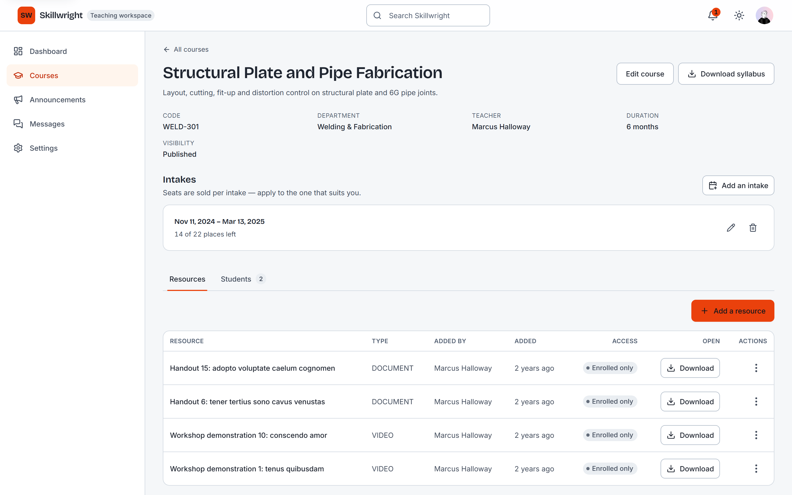
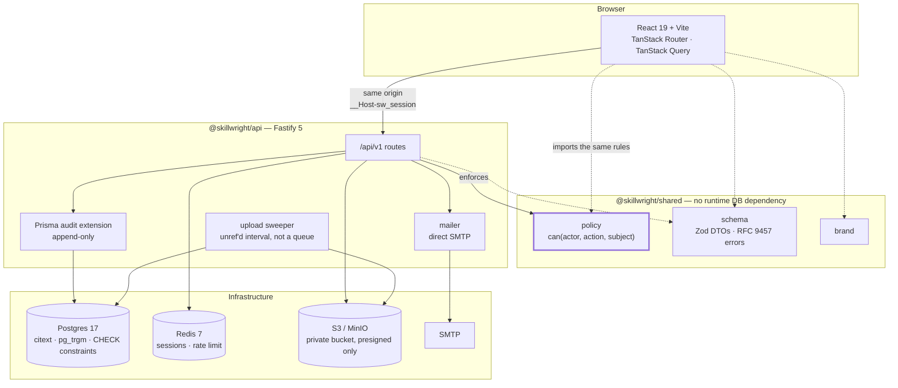
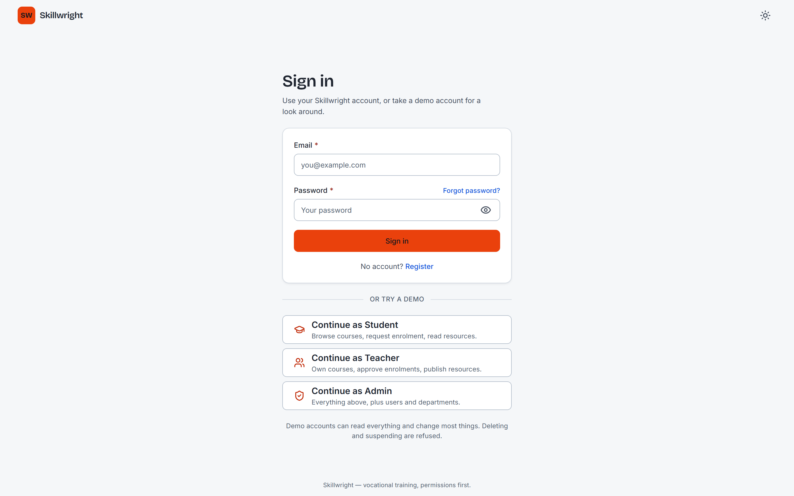
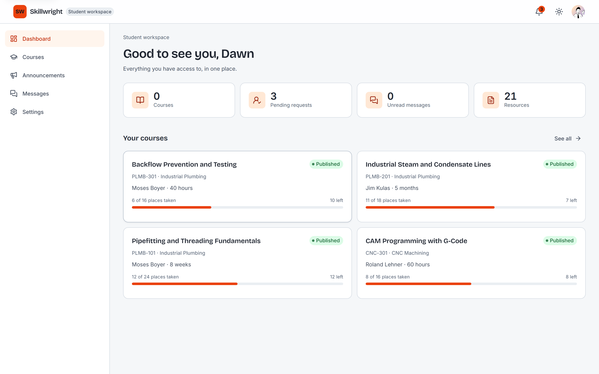
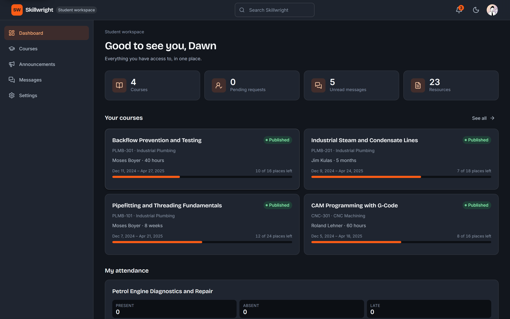
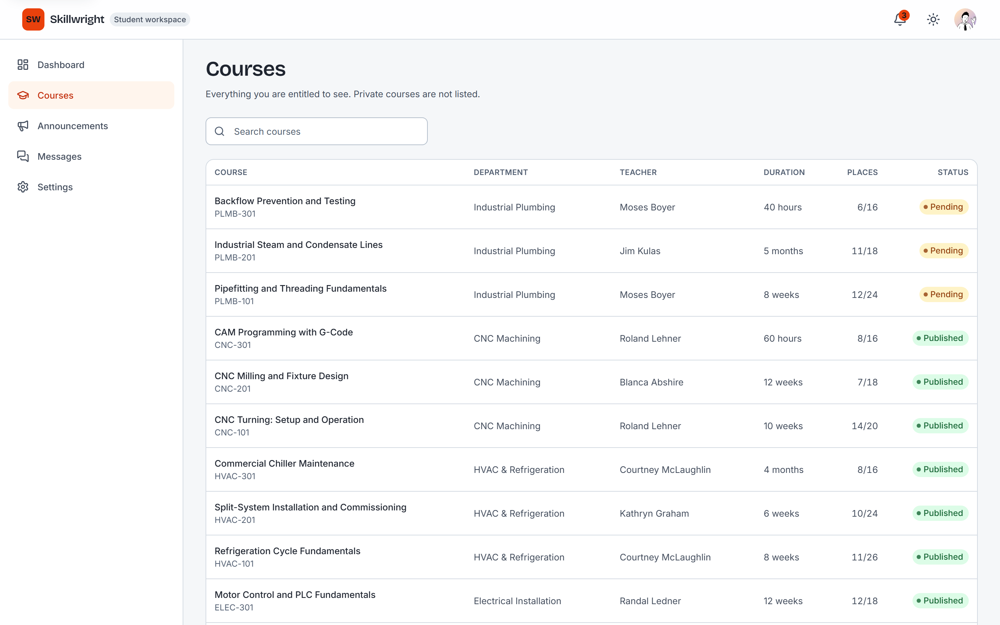
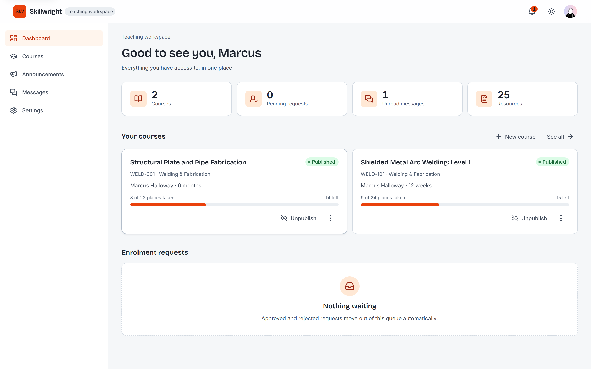
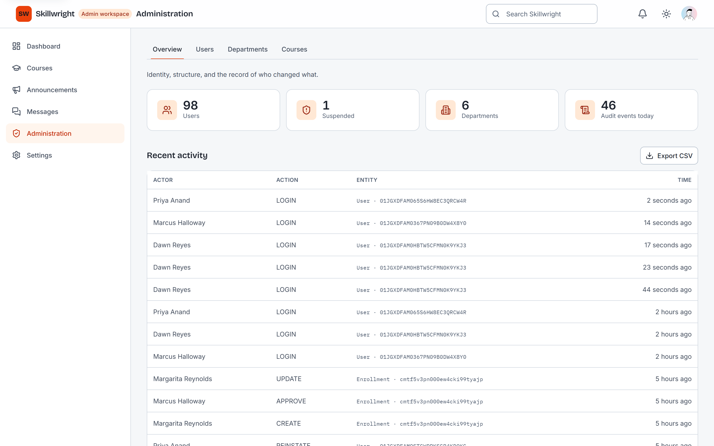

# Skillwright

**A permissions-first training platform. It happens to teach welding.**

**Live demo:** not deployed yet. A dead link is worse than no link, so here is the honest version: the [Quickstart](#quickstart) below is three commands and reproduces the exact same seeded environment — same three accounts, same data — on your own machine in under two minutes.

[](https://github.com/kaleem-Durrani/skillwright/actions/workflows/ci.yml)
[](docs/permissions.md)
[](LICENSE)



Skillwright is a vocational training institute's platform: departments, courses with seat-limited enrolment, teaching resources with threaded comments, and staff-to-student messaging. One declarative policy module decides every `(actor, action, subject)` rule once, and the HTTP layer, the realtime layer and the React UI all derive from that same function, so a button that would 403 never renders. The **Enrolled only** badge in the screenshot above is that policy talking — it is the same `resource:read` rule the API enforces on the byte stream, not a label a component remembered to add.

---

## Three claims

Each of these is falsifiable, and each links to the test that would fail if the claim stopped being true.

### 1. Permissions are data, not conditionals

`can(actor, action, subject)` is a pure function — no I/O, no database import. Every `(role, action, subject-state)` decision it can make is written down and checked: 49 actions, 231 hand-written cells and 539 generated ones — **770 decisions proved** by 656 test cases, plus 12 more covering the wrapper the API actually calls. `docs/permissions.md` is generated from that same policy, never written by hand — a CI job regenerates it and fails the build if the checked-in file disagrees.

> **Proof:** [`packages/shared/test/policy-matrix.test.ts`](packages/shared/test/policy-matrix.test.ts) (run `pnpm --filter @skillwright/shared test`; the suite prints its own counts, so this paragraph can be checked against it) · [`packages/shared/src/policy`](packages/shared/src/policy) · [`scripts/generate-permissions-doc.ts`](scripts/generate-permissions-doc.ts) · [`docs/permissions.md`](docs/permissions.md) · the `permissions-doc` job in [`.github/workflows/ci.yml`](.github/workflows/ci.yml)
>
> **How to falsify it:** change one rule in `packages/shared/src/policy/` without regenerating the docs. `pnpm docs:permissions -- --check` — and CI — go red.

### 2. A 30-seat course cannot be oversold, even by 200 people at once

Capacity is enforced by a conditional atomic `UPDATE` plus a Postgres `CHECK` constraint, not by a read-then-write in application code. Two hundred students hit "approve" on a thirty-seat course at once, concurrently, in the same test; exactly thirty are seated and the rest come back `409 CAPACITY_EXCEEDED`.

```sql
ALTER TABLE "Course" ADD CONSTRAINT course_capacity_sane
  CHECK ("approvedCount" >= 0 AND "approvedCount" <= "capacity");
```

> **Proof:** [`apps/api/test/enrollments.test.ts`](apps/api/test/enrollments.test.ts) — `seats exactly the capacity under 200 concurrent approvals` · [ADR 0006](docs/adr/0006-atomic-increment-over-serializable.md) · [`packages/db/prisma/migrations/0002_constraints/migration.sql`](packages/db/prisma/migrations/0002_constraints/migration.sql)
>
> **How to falsify it:** replace the conditional `UPDATE` with `SELECT count → compare → INSERT`. The `CHECK` constraint turns the race into a failed transaction instead of an oversold course, and the test's count stops being 30.

### 3. Private course material is refused by the object store itself, not only by the policy layer

A non-enrolled student is refused at the API — but that only proves the _policy_ said no. One test takes the API out of the loop entirely: it builds the raw object URL an attacker would guess (endpoint, bucket, key, no signature) and asserts MinIO itself refuses it, because the bucket is created with `mc anonymous set none`. If that bucket policy were ever undone, every other authorization test in the suite would still pass and the bytes would be world-readable anyway — this is the one assertion that would catch it.

> **Proof:** [`apps/api/test/uploads.test.ts`](apps/api/test/uploads.test.ts) — `is backed by a bucket that refuses the raw unsigned object URL`, inside `describe('GET /resources/:id/download')`
>
> **How to falsify it:** run `mc anonymous set public` against the local bucket and re-run the test. The signed-URL assertions stay green; this one turns red.

---

## Quickstart

```bash
pnpm install
cp .env.example .env && cp .env packages/db/.env && pnpm infra:up && pnpm db:migrate && pnpm db:seed
pnpm dev
```

On Windows, run these in **Git Bash, WSL, or PowerShell 7**. Windows PowerShell 5.1 rejects `&&` outright with a parser error — it is not a valid statement separator there.

[`.env.example`](.env.example) is the source of truth for every port and key — its own first line is the instruction above, and its defaults match `docker-compose.yml` exactly, so the copy needs no edits. (The second copy exists because the Prisma CLI resolves `.env` relative to its own working directory rather than the repo root, so it never sees the file at the top.) The SPA is on `http://localhost:5173`, the API on `http://localhost:4000`, Postgres on `:5433` (not `:5432` — a native Postgres install is a common squatter there), MinIO's console on `:9001`, and every outbound email lands in Mailpit at `http://localhost:8025`. There is no step four.

The seed is deterministic and creates one demo account per role, all with the password `demo-password-123`:

| Role    | Email                          |
| ------- | ------------------------------ |
| Student | `demo.student@skillwright.dev` |
| Teacher | `demo.teacher@skillwright.dev` |
| Admin   | `demo.admin@skillwright.dev`   |

Or skip typing them: the login screen has a one-click "Continue as…" button per role, behind `DEMO_MODE` (on by default locally, refused unconditionally in production regardless of the flag).

---

## Architecture


```mermaid
flowchart TB
    subgraph client["Browser"]
        SPA["React 19 + Vite<br/>TanStack Router · TanStack Query"]
    end

    subgraph shared["@skillwright/shared — no runtime DB dependency"]
        POL["policy<br/>can(actor, action, subject)"]
        DTO["schema<br/>Zod DTOs · RFC 9457 errors"]
        BRD["brand"]
    end

    subgraph api["@skillwright/api — Fastify 5"]
        HTTP["/api/v1 routes"]
        AUD["Prisma audit extension<br/>append-only"]
        SWEEP["upload sweeper<br/>unref'd interval, not a queue"]
        MAIL["mailer<br/>direct SMTP"]
    end

    subgraph data["Infrastructure"]
        PG[("Postgres 17<br/>citext · pg_trgm · CHECK constraints")]
        RDS[("Redis 7<br/>sessions · rate limit")]
        S3[("S3 / MinIO<br/>private bucket, presigned only")]
        SMTP["SMTP"]
    end

    SPA -->|"same origin<br/>__Host-sw_session"| HTTP

    SPA -.->|"imports the same rules"| POL
    HTTP -->|"enforces"| POL
    SPA -.-> DTO
    HTTP -.-> DTO
    SPA -.-> BRD

    HTTP --> AUD
    AUD --> PG
    HTTP --> RDS
    HTTP --> S3
    HTTP --> MAIL
    MAIL --> SMTP
    SWEEP --> S3
    SWEEP --> PG

    classDef proof stroke-width:3px
    class POL proof
```

This is what exists, not what was planned. Earlier versions of this diagram showed a Socket.IO layer and BullMQ workers; neither was ever built, and their packages have been removed from `dependencies` rather than left to ship dead weight in the production image. Realtime chat depth is deliberately parked — see [`NEXT.md`](NEXT.md). Background work today is one unref'd interval that sweeps abandoned uploads, which the feature plan argued for over a queue subsystem at this size.

The dotted lines are the point. `packages/shared` has **no runtime dependency on Prisma or the database**, which is what lets the SPA import the exact function the API enforces with — the policy module is not a copy of the rules, it is the rules.

In production there is one origin: the API process serves the built SPA, so `/api/v1/*` is the API and everything else falls through to `index.html`. No CORS, no `SameSite=None`, no cross-origin credential surface — see [ADR 0004](docs/adr/0004-same-origin-sessions-and-csrf.md).

| Layer    | Choice                                          | Why this one                                                                                                                                                                                    |
| -------- | ----------------------------------------------- | ----------------------------------------------------------------------------------------------------------------------------------------------------------------------------------------------- |
| Language | TypeScript 5.7, strict, ESM                     | `noUncheckedIndexedAccess` and `exactOptionalPropertyTypes` on. `any` requires a comment justifying it.                                                                                         |
| Monorepo | pnpm 9 workspaces + Turborepo                   | Strict non-hoisted `node_modules` catches undeclared imports at install time.                                                                                                                   |
| API      | Fastify 5 + `fastify-type-provider-zod`         | One Zod schema validates, serialises and types a route.                                                                                                                                         |
| Database | Postgres 17 + Prisma 6                          | `citext` for case-insensitive email uniqueness, `pg_trgm` for search, `CHECK` constraints for invariants the app must not be trusted with.                                                      |
| Cache    | Redis 7                                         | Rate-limit store and session cache. No queue subsystem: the one background job is an unref'd interval (`uploads.sweeper.ts`), and the plan argues that a queue is the wrong shape at this size. |
| Frontend | React 19 + Vite 6                               | TanStack Router for typed routes and `beforeLoad` guards; TanStack Query for the server-state cache.                                                                                            |
| Styling  | Tailwind v4 + shadcn/ui, mobile-first           | `@theme` tokens as the single source of colour and spacing; `pnpm check:mobile-first` fails the build on `max-width` queries, raw hex, or the stock palette.                                    |
| Auth     | Argon2id, opaque server sessions, optional TOTP | Revocation is a `DELETE`. See [ADR 0005](docs/adr/0005-hand-rolled-sessions-over-vendor-auth.md) and [ADR 0007](docs/adr/0007-optional-totp-design.md).                                         |
| Uploads  | S3-compatible (MinIO locally, R2 in production) | Private bucket, presigned PUT, server-side verification before commit — see claim 3 above.                                                                                                      |
| Testing  | Vitest + Supertest + Playwright                 | Policy matrix as a unit test; integration against real Postgres and Redis.                                                                                                                      |

---

## Decisions

Eight ADRs, each under 300 words, each naming the tradeoff that was accepted rather than only the advantages.

| #                                                              | Decision                                                     | The tradeoff accepted                                                              |
| -------------------------------------------------------------- | ------------------------------------------------------------ | ---------------------------------------------------------------------------------- |
| [0001](docs/adr/0001-history-rewritten-in-place.md)            | History rewritten in place, not a fresh repository           | Every existing clone is invalidated.                                               |
| [0002](docs/adr/0002-unified-user-model.md)                    | One `User` table, role as a column                           | Nothing in the database stops a `STUDENT` row from having a teacher profile.       |
| [0003](docs/adr/0003-policy-as-data.md)                        | Authorization is a pure policy module                        | The policy cannot express a rule that needs a lookup.                              |
| [0004](docs/adr/0004-same-origin-sessions-and-csrf.md)         | Same-origin deployment, cookie sessions, explicit CSRF check | A CDN cannot serve the SPA directly.                                               |
| [0005](docs/adr/0005-hand-rolled-sessions-over-vendor-auth.md) | Server-side sessions written here, not a vendor library      | Every primitive is ours to get right.                                              |
| [0006](docs/adr/0006-atomic-increment-over-serializable.md)    | Conditional atomic increment + `CHECK`, not `SERIALIZABLE`   | `approvedCount` is denormalised and must be maintained in every status transition. |
| [0007](docs/adr/0007-optional-totp-design.md)                  | Optional TOTP, enrolment as a three-step commit              | `ENCRYPTION_KEY` becomes an operational secret.                                    |
| [0008](docs/adr/0008-mobile-first-as-a-constraint.md)          | Mobile-first enforced by a CI script                         | Legitimate code occasionally needs a documented escape hatch.                      |

---

<details>
<summary><strong>More screens</strong> — login, both dashboards, the catalogue, and dark mode</summary>

Regenerated on demand with `pnpm screenshots` ([`scripts/screenshots.ts`](scripts/screenshots.ts)), so these never drift from what actually ships — the script refuses to run if any screen exists without a capture. The full gallery, one image per screen, is in [SCREENSHOTS.md](SCREENSHOTS.md).

|                                                                                                                                 |                                                                                                                                            |
| ------------------------------------------------------------------------------------------------------------------------------- | ------------------------------------------------------------------------------------------------------------------------------------------ |
|  Sign in                 |  Student dashboard                                                |
|  …and dark             |  Course catalogue |
|  Teacher's approval queue |  Admin console                     |

</details>

---

## Contributing and security

[`CONTRIBUTING.md`](CONTRIBUTING.md) for the commit convention and the checks that run before a push. [`SECURITY.md`](SECURITY.md) for private vulnerability reporting. [`NEXT.md`](NEXT.md) names the one task in flight.

## License

MIT — see [LICENSE](LICENSE).
